# JARI — Linker-Driven Drug Design (Showcase)

**JARI** (Joey's Analysis of Rational Interlinkers) is a script-based toolkit for prioritizing PROTAC linker candidates based on clustering and pose evaluation. Inspired by PRosettaC’s original approach, JARI enables a **linker-first** strategy where conformers are clustered and scored based on their ability to reproduce high-quality ternary docking outputs.

🧪 This is a public showcase repo (documentation + figures only). Source code and core algorithms are not exposed here.

---

## 🔬 Overview

  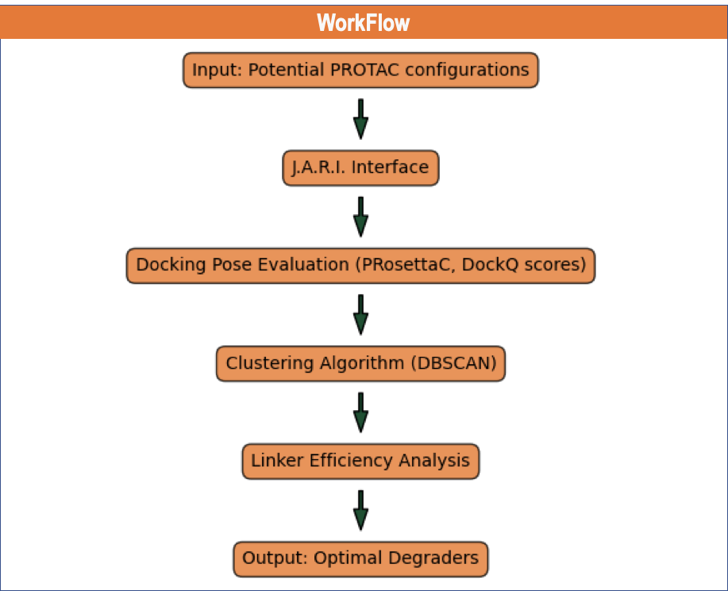

JARI is built to help answer the question: **"Given a large number of docked ternary complexes, which linkers yield the most favorable arrangements of PPI between the Target Protein and Ligase Protein, consistently across the generated models."**

The method assumes docking outputs from tools like PRosettaC and uses:
- Pairwise **DockQ similarity matrices**
- **DBSCAN** and **hierarchical clustering**
- **Silhouette scoring** for optimal epsilon search
- **Network graphs** to visualize top cluster connections

---

## 📊 Pipeline

```text
Input: HeadA + HeadB poses (from PRosettaC)
        ↓
Align heads, sample linker conformers
        ↓
Evaluate DockQ across poses
        ↓
Cluster by DBSCAN / Hierarchical
        ↓
Rank clusters by cohesion, size, and average score
        ↓
Output: Optimal linker candidates
```

---

## 🖼️ Figures

### 1. DBSCAN Parameter Exploration

- **Cluster count vs. epsilon**  
  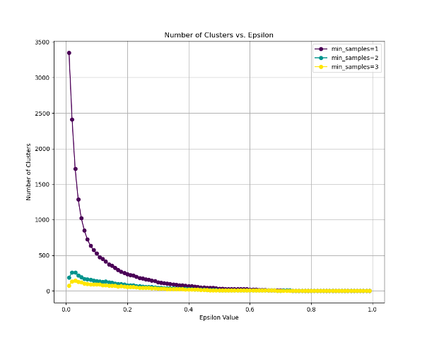

- **Size of Largest Cluster vs. epsilon**  
  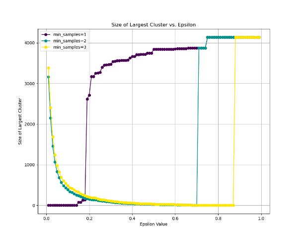

- **Silhouette score vs. epsilon**  
  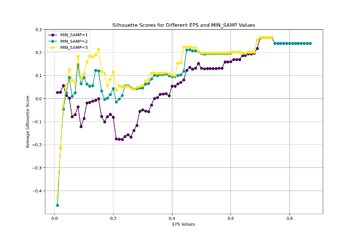

### 2. Top Cluster Analysis

- **Network of top models**  
  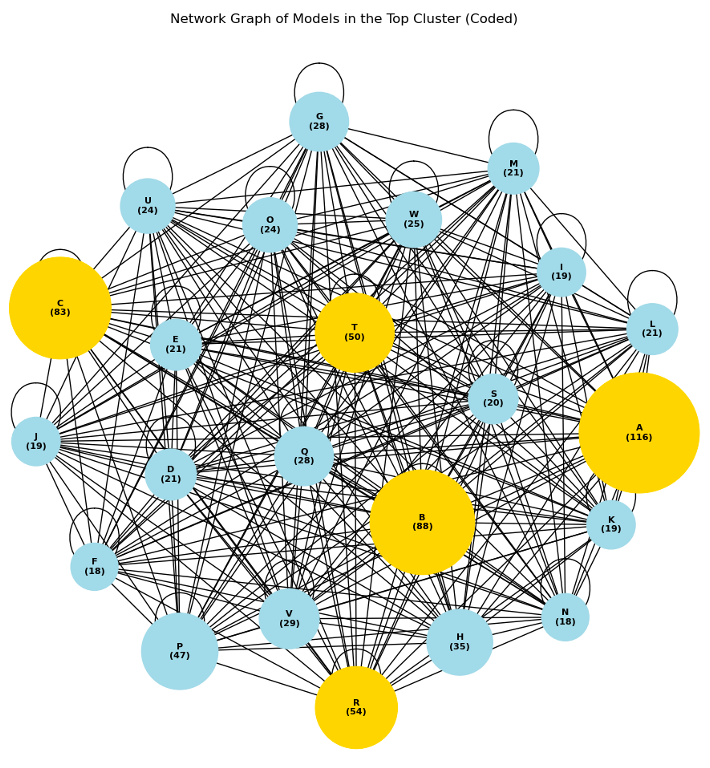

- **Bar plot of model frequencies**  
  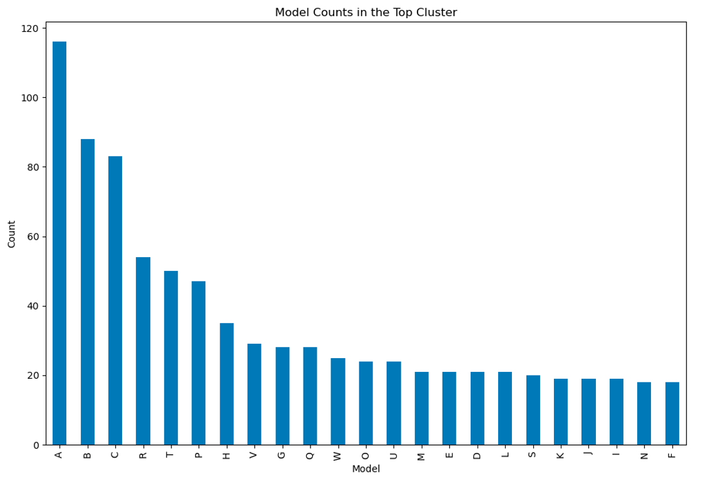

### 3. Hierarchical Insights

- **Colored Dendrogram**  
  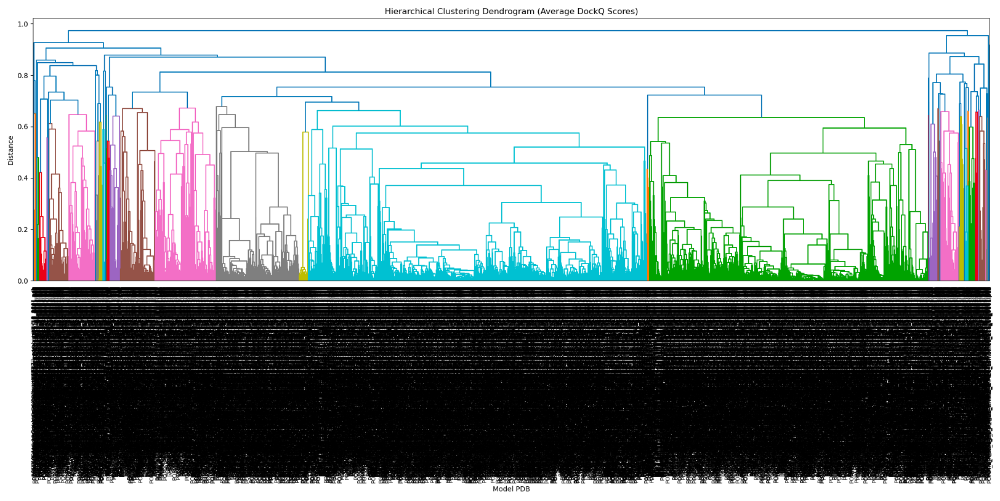

- **Distance heatmap**  
  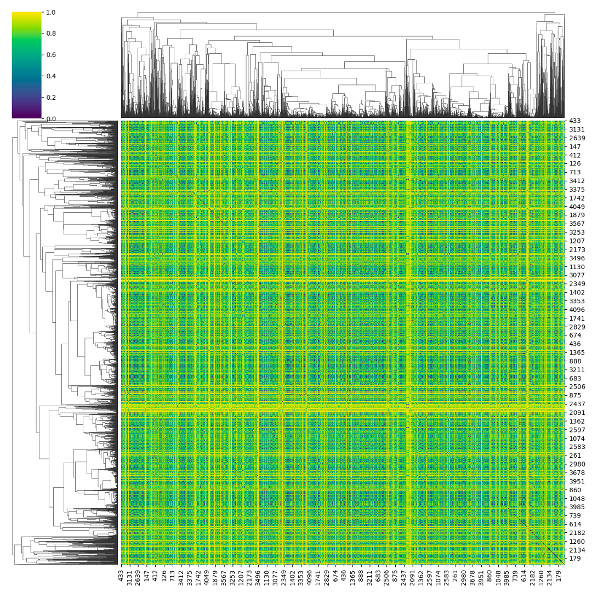

### 4. Molecular Example

- **PROTAC Docked Pose Snapshot**  
  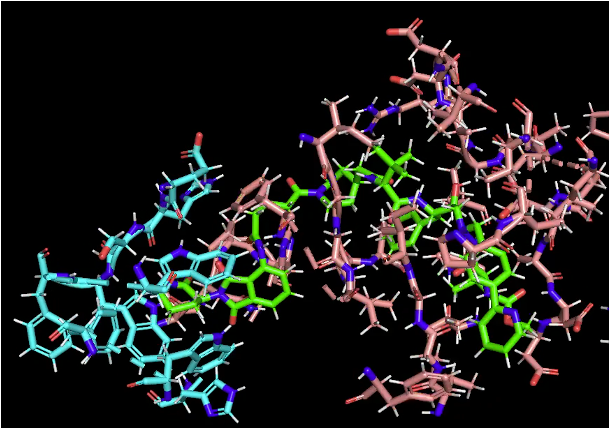

### 5. MD Extensions (Coming Soon)

- **RMSF (ligase/warhead)**  
  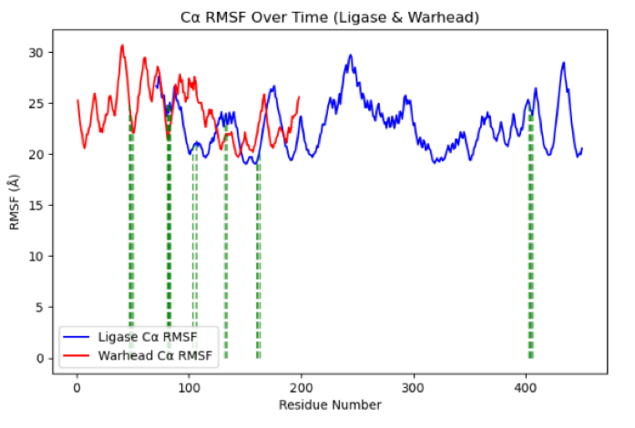

- **SME Assignment (by time)**  
  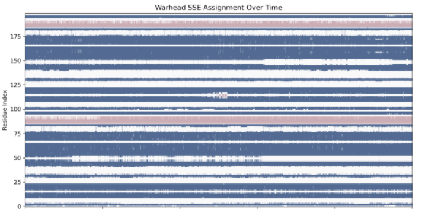

---

## 🧠 Key Concepts

### Clustering with DBSCAN

- **Epsilon (`eps`)**: max distance between points to consider them neighbors
- **min_samples**: minimum number of samples in a neighborhood to form a cluster

We optimize for **high silhouette scores** (cluster cohesion) and **sufficient cluster sizes**.

### Network Graphs

Top clusters are visualized by frequency of appearance (node size) and shared participation in models (edge thickness). This makes it easier to see which linkers are most frequently associated with consistent top-scoring poses.

### Heatmaps and Dendrograms

DockQ similarity matrices are analyzed via average linkage hierarchical clustering to highlight families of structurally similar ternary poses. These patterns help identify potential linker classes.

---

## 🚧 Limitations & Next Steps

- Current clustering is post hoc — no dynamic reweighting or pose adaptation
- Assumes quality DockQ scoring and valid input alignments
- DBSCAN parameters must be carefully tuned; not universal across targets

**Next goals**:
- Integrate flexible scoring metrics (e.g., interface RMSD)
- Combine with MD-based frame scoring for dynamic stability
- Automate linker synthesis suggestions from top clusters

---

## 🗂️ File Map

```
jari-linker-design-showcase/
├── README.md
└── assets/
    ├── jari_cluster_vs_eps.png
    ├── jari_silhouette_vs_eps.png
    ├── jari_network_graph.png
    ├── jari_model_frequencies.png
    ├── jari_workflow.png
    ├── jari_dendrogram.png
    ├── jari_heatmap.png
    ├── jari_docked_pose.png
    ├── jari_rmsf.png
    └── jari_sme_matrix.png
    
```

---

📩 Contact: **jmschulz@med.miami.edu**
